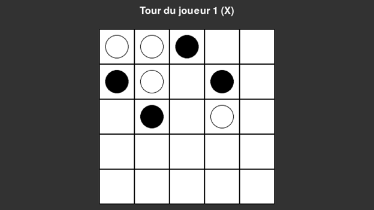

# IA41-Tekko

# Tekko - Version Numérique

Tekko est un jeu de stratégie développé en Python 3 à l'aide de la bibliothèque Pygame. Le jeu met en avant des mécaniques engageantes où les joueurs affrontent des intelligences artificielles avec trois niveaux de difficulté :

Facile

Normale

Difficile

L'objectif principal du projet est d'offrir une expérience enrichissante à travers une IA bien conçue, adaptée aux joueurs de tous niveaux.
Toutes les librairies nécessaires sont incluses dans le projet, vous permettant de démarrer rapidement sans configuration supplémentaire.

## 📋 Fonctionnalités

- Gameplay stratégique : Implémentation fluide des règles et mécaniques de Tekko.
- Trois niveaux de difficulté d'IA : Jouez contre des adversaires allant de simples mouvements aléatoires (échelle facile) à des stratégies avancées (échelle difficile).
- Interface utilisateur immersive : Graphismes soignés et interface intuitive conçue avec Pygame.

---

## Aperçu de l'interface

Voici un aperçu de l'interface utilisateur de l'application :



---

## 🚀 Installation et Exécution

1. Clonez ou téléchargez ce dépôt :
   ```bash
     git clone https://github.com/TalhaK28/IA41-Tekko.git
   cd IA41-Tekko
